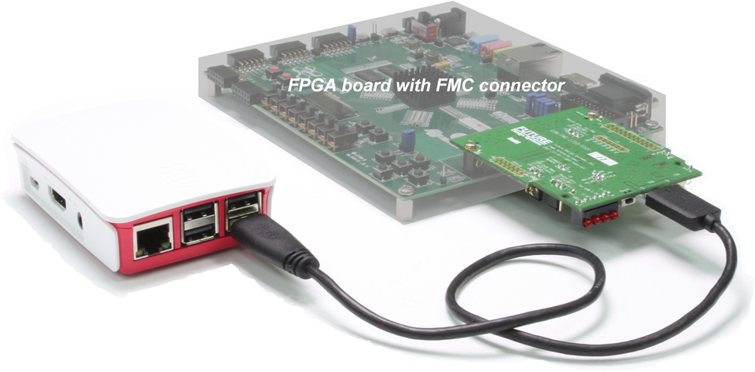

# CON-FMC<sup>TM</sup>
**CON-FMC** is an FMC (FPGA Mezzanine Card) and connects computer to the FPGA through USB 3.0/2.0.<br>
More details can be found at <a href="http://www.future-ds.com/en/products.html#CON_FMC" target="_blank">here</a>.
This page contains software package version 2020.06 for CON-FMC.


## License
FUTURE DESIGN SYSTEMS SOFTWARE END-USER LICENSE AGREEMENT FOR CON-FMC.<br>
See '[EULA.txt](EULA.txt)' file.

## How to install
See '*Section 3 Software installation*' of '[doc/FDS-TD-2018-03-001-CON-FMC-User-Manual.pdf](doc/FDS-TD-2018-03-001-CON-FMC-User-Manual.pdf)'.

### Linux
 1. Get the package from GitHub, where '*2020.06*' stands for version<br>
   ```$ git clone https://github.com/github-fds/confmc.x86_64.linux.2020.06.git```
 2. Down to the retrieved directory<br>
   ```$ cd confmc.x86_64.linux.2020.06```
 3. Run '*coninstall.sh*' with root permission<br>
   ```$ sudo ./coninstall.sh```<br>
    Use '*-dst install_dir*' option to specify installation directory, otherwise '*/opt/confmc/2020.06*' will be used by default, where '*2020.06*' can be vary depending on version.
 4. Do not forget to source setup script before using this package. Then, all necessary environment variables will be set for you.
    * for default Python<br>
    ```$ source /opt/confmc/2020.06/settings.sh```<br>
    * for default Python version 2<br>
    ```$ source /opt/confmc/2020.06/settings.sh -python 2```<br>
    * for default Python version 3<br>
    ```$ source /opt/confmc/2020.06/settings.sh -python 3```<br>

### Windows
 1. Get the package from GitHub, where '*2020.06*' stands for version<br>
   ```> git clone https://github.com/github-fds/confmc.x86_64.mingw.2020.06.git```
 2. Copy the retrieved directory to somewhere<br>
   ```> copy confmc.x86_64.mingw.2020.06 C:\confmc\2020.06```
 3. Set '**CONFMC_HOME**' environment variable to '*C:\confmc\2020.06*'<br>
   ```> setx -m CONFMC_HOME C:\confmc\2020.06```

## How to use
Refer to following documents.<br>
* [doc/FDS-TD-2018-03-001-CON-FMC-User-Manual.pdf](doc/FDS-TD-2018-03-001-CON-FMC-User-Manual.pdf)
* [doc/FDS-TD-2018-04-004-CON-FMC-API.pdf](doc/FDS-TD-2018-04-004-CON-FMC-API.pdf)

Refer to examples available at <a href="https://github.com/github-fds/confmc.examples" target="_blank">here</a>.

## What's new
Refer to '[RELEASE_NOTES.txt](RELEASE_NOTES.txt)'.

## Contact
* <a href="http://www.future-ds.com" target="_blank">**Future Design Systems**</a>
* **[contact@future-ds.com](mailto:contact@future-ds.com)**
